# Galileo Specification

A personal AI assistant with knowledge graph memory, local model routing, and Obsidian integration. Multi-channel support, persistent memory per conversation, scheduled tasks, and container-isolated agent execution. Built on NanoClaw.

---

## Table of Contents

1. [Architecture](#architecture)
2. [Architecture: Channel System](#architecture-channel-system)
3. [Folder Structure](#folder-structure)
4. [Configuration](#configuration)
5. [Knowledge Graph Memory](#knowledge-graph-memory)
6. [Local Model Routing](#local-model-routing)
7. [Obsidian Integration](#obsidian-integration)
8. [Memory System](#memory-system)
9. [Session Management](#session-management)
10. [Message Flow](#message-flow)
11. [Commands](#commands)
12. [Scheduled Tasks](#scheduled-tasks)
13. [MCP Servers](#mcp-servers)
14. [Deployment](#deployment)
15. [Security Considerations](#security-considerations)

---

## Architecture

```
┌──────────────────────────────────────────────────────────────────────┐
│                        HOST (macOS / Linux)                           │
│                     (Main Node.js Process)                            │
├──────────────────────────────────────────────────────────────────────┤
│                                                                       │
│  ┌──────────────────┐                  ┌────────────────────┐        │
│  │ Channels         │─────────────────▶│   SQLite Database  │        │
│  │ (self-register   │◀────────────────│   (messages.db)    │        │
│  │  at startup)     │  store/send      └─────────┬──────────┘        │
│  └──────────────────┘                            │                   │
│                                                   │                   │
│  ┌──────────────────┐    ┌──────────────────────┐│                   │
│  │ Galileo Memory   │    │ Credential Proxy     ││                   │
│  │ (Neo4j + LM      │    │ (Anthropic↔OpenAI    ││                   │
│  │  Studio embed)   │    │  translation +       ││                   │
│  └────────┬─────────┘    │  local routing)      ││                   │
│           │              └──────────┬───────────┘│                   │
│           │                         │             │                   │
│         ┌─┴─────────────────────────┘             │                   │
│         │                                         │                   │
│         ▼                                         ▼                   │
│  ┌──────────────────┐    ┌──────────────────┐    ┌───────────────┐   │
│  │  Message Loop    │    │  Scheduler Loop  │    │  IPC Watcher  │   │
│  │  (polls SQLite)  │    │  (checks tasks)  │    │  (file-based) │   │
│  └────────┬─────────┘    └────────┬─────────┘    └───────────────┘   │
│           │                       │                                   │
│           └───────────┬───────────┘                                   │
│                       │ spawns container                              │
│                       ▼                                               │
├──────────────────────────────────────────────────────────────────────┤
│                     CONTAINER (Linux VM)                               │
├──────────────────────────────────────────────────────────────────────┤
│  ┌──────────────────────────────────────────────────────────────┐    │
│  │                    AGENT RUNNER                               │    │
│  │                                                                │    │
│  │  Working directory: /workspace/group (mounted from host)       │    │
│  │  Volume mounts:                                                │    │
│  │    • groups/{name}/ → /workspace/group                         │    │
│  │    • groups/global/ → /workspace/global/ (non-main only)       │    │
│  │    • data/sessions/{group}/.claude/ → /home/node/.claude/      │    │
│  │    • Additional dirs → /workspace/extra/*                      │    │
│  │                                                                │    │
│  │  API calls → Credential proxy → LM Studio or Anthropic        │    │
│  │                                                                │    │
│  │  Tools (all groups):                                           │    │
│  │    • Bash (safe - sandboxed in container!)                     │    │
│  │    • Read, Write, Edit, Glob, Grep (file operations)           │    │
│  │    • WebSearch, WebFetch (internet access)                     │    │
│  │    • agent-browser (browser automation)                        │    │
│  │    • mcp__galileo__* (scheduler tools via IPC)                 │    │
│  │                                                                │    │
│  └──────────────────────────────────────────────────────────────┘    │
│                                                                       │
└───────────────────────────────────────────────────────────────────────┘

External Services:
  ┌─────────────┐   ┌─────────────────┐   ┌───────────────────┐
  │ Neo4j       │   │ LM Studio       │   │ Obsidian Vault    │
  │ (knowledge  │   │ (local models   │   │ (Markdown notes   │
  │  graph)     │   │  via LMLink)    │   │  via launchd)     │
  └─────────────┘   └─────────────────┘   └───────────────────┘
```

### Technology Stack

| Component | Technology | Purpose |
|-----------|------------|---------|
| Channel System | Channel registry (`src/channels/registry.ts`) | Channels self-register at startup |
| Message Storage | SQLite (better-sqlite3) | Store messages for polling |
| Container Runtime | Containers (Linux VMs) | Isolated environments for agent execution |
| Agent | @anthropic-ai/claude-agent-sdk (0.2.29) | Run Claude with tools and MCP servers |
| Browser Automation | agent-browser + Chromium | Web interaction and screenshots |
| Knowledge Graph | Neo4j + neo4j-driver | Episode storage, entity extraction, hybrid search |
| Embeddings | nomic-embed-text v1.5 via LM Studio | 768-dim vectors for semantic search |
| Entity Extraction | Qwen 3.5 9B via LM Studio | Extract entities and relationships from conversations |
| Local Agent Model | Qwen 3.5 27B via LM Studio | Full agent capabilities routed through credential proxy |
| API Translation | Credential proxy (`src/credential-proxy.ts`) | Bidirectional Anthropic ↔ OpenAI format conversion |
| Note Export | Obsidian writer + launchd | Nightly consolidation, weekly synthesis, entity sync |
| Runtime | Node.js 20+ | Host process for routing and scheduling |

---

## Architecture: Channel System

The core ships with no channels built in — each channel (WhatsApp, Telegram, Slack, Discord, Gmail) is installed as a [Claude Code skill](https://code.claude.com/docs/en/skills) that adds the channel code to your fork. Channels self-register at startup; installed channels with missing credentials emit a WARN log and are skipped.

### System Diagram

```mermaid
graph LR
    subgraph Channels["Channels"]
        WA[WhatsApp]
        TG[Telegram]
        SL[Slack]
        DC[Discord]
        New["Other Channel (Signal, Gmail...)"]
    end

    subgraph Orchestrator["Orchestrator — index.ts"]
        ML[Message Loop]
        GQ[Group Queue]
        RT[Router]
        TS[Task Scheduler]
        DB[(SQLite)]
    end

    subgraph GalileoMemory["Galileo Memory"]
        NEO[(Neo4j)]
        HS[Hybrid Search]
        EE[Entity Extractor]
        EM[Embeddings]
    end

    subgraph Execution["Container Execution"]
        CR[Container Runner]
        CP[Credential Proxy]
        LC["Linux Container"]
        IPC[IPC Watcher]
    end

    subgraph LocalModels["LM Studio"]
        Q27[Qwen 3.5 27B]
        Q9[Qwen 3.5 9B]
        NE[nomic-embed-text]
    end

    %% Flow
    WA & TG & SL & DC & New -->|onMessage| ML
    ML --> GQ
    GQ -->|recallMemory| HS
    HS --> NEO
    HS --> EM
    EM --> NE
    GQ -->|concurrency| CR
    CR --> CP
    CP -->|LOCAL_FIRST| Q27
    CP -->|CLAUDE_ONLY| Anthropic[Anthropic API]
    CP --> LC
    LC -->|filesystem IPC| IPC
    IPC -->|tasks & messages| RT
    RT -->|Channel.sendMessage| Channels
    RT -->|storeMemory| NEO
    EE --> Q9
    TS -->|due tasks| CR

    %% DB Connections
    DB <--> ML
    DB <--> TS

    %% Styling
    style New stroke-dasharray: 5 5,stroke-width:2px
    style GalileoMemory fill:#1a1a2e
    style LocalModels fill:#16213e
```



### Channel Registry

The channel system is built on a factory registry in `src/channels/registry.ts`:

```typescript
export type ChannelFactory = (opts: ChannelOpts) => Channel | null;

const registry = new Map<string, ChannelFactory>();

export function registerChannel(name: string, factory: ChannelFactory): void {
  registry.set(name, factory);
}

export function getChannelFactory(name: string): ChannelFactory | undefined {
  return registry.get(name);
}

export function getRegisteredChannelNames(): string[] {
  return [...registry.keys()];
}
```

Each factory receives `ChannelOpts` (callbacks for `onMessage`, `onChatMetadata`, and `registeredGroups`) and returns either a `Channel` instance or `null` if that channel's credentials are not configured.

### Channel Interface

Every channel implements this interface (defined in `src/types.ts`):

```typescript
interface Channel {
  name: string;
  connect(): Promise<void>;
  sendMessage(jid: string, text: string): Promise<void>;
  isConnected(): boolean;
  ownsJid(jid: string): boolean;
  disconnect(): Promise<void>;
  setTyping?(jid: string, isTyping: boolean): Promise<void>;
  syncGroups?(force: boolean): Promise<void>;
}
```

### Self-Registration Pattern

Channels self-register using a barrel-import pattern:

1. Each channel skill adds a file to `src/channels/` (e.g. `whatsapp.ts`, `telegram.ts`) that calls `registerChannel()` at module load time:

   ```typescript
   // src/channels/whatsapp.ts
   import { registerChannel, ChannelOpts } from './registry.js';

   export class WhatsAppChannel implements Channel { /* ... */ }

   registerChannel('whatsapp', (opts: ChannelOpts) => {
     // Return null if credentials are missing
     if (!existsSync(authPath)) return null;
     return new WhatsAppChannel(opts);
   });
   ```

2. The barrel file `src/channels/index.ts` imports all channel modules, triggering registration:

   ```typescript
   import './whatsapp.js';
   import './telegram.js';
   // ... each skill adds its import here
   ```

3. At startup, the orchestrator (`src/index.ts`) loops through registered channels and connects whichever ones return a valid instance:

   ```typescript
   for (const name of getRegisteredChannelNames()) {
     const factory = getChannelFactory(name);
     const channel = factory?.(channelOpts);
     if (channel) {
       await channel.connect();
       channels.push(channel);
     }
   }
   ```

### Key Files

| File | Purpose |
|------|---------|
| `src/channels/registry.ts` | Channel factory registry |
| `src/channels/index.ts` | Barrel imports that trigger channel self-registration |
| `src/types.ts` | `Channel` interface, `ChannelOpts`, message types |
| `src/index.ts` | Orchestrator — instantiates channels, runs message loop |
| `src/router.ts` | Finds the owning channel for a JID, formats messages |

### Adding a New Channel

To add a new channel, contribute a skill to `.claude/skills/add-<name>/` that:

1. Adds a `src/channels/<name>.ts` file implementing the `Channel` interface
2. Calls `registerChannel(name, factory)` at module load
3. Returns `null` from the factory if credentials are missing
4. Adds an import line to `src/channels/index.ts`

See existing skills (`/add-whatsapp`, `/add-telegram`, `/add-slack`, `/add-discord`, `/add-gmail`) for the pattern.

---

## Folder Structure

```
galileo/
├── CLAUDE.md                      # Project context for Claude Code
├── docs/
│   ├── SPEC.md                    # This specification document
│   ├── REQUIREMENTS.md            # Architecture decisions
│   └── SECURITY.md                # Security model
├── README.md                      # User documentation
├── package.json                   # Node.js dependencies
├── tsconfig.json                  # TypeScript configuration
├── .mcp.json                      # MCP server configuration (reference)
├── .gitignore
│
├── src/
│   ├── index.ts                   # Orchestrator: state, message loop, agent invocation
│   ├── channels/
│   │   ├── registry.ts            # Channel factory registry
│   │   └── index.ts               # Barrel imports for channel self-registration
│   ├── credential-proxy.ts        # Credential injection + local model routing
│   ├── ipc.ts                     # IPC watcher and task processing
│   ├── router.ts                  # Message formatting and outbound routing
│   ├── config.ts                  # Configuration constants
│   ├── types.ts                   # TypeScript interfaces (includes Channel)
│   ├── logger.ts                  # Pino logger setup
│   ├── db.ts                      # SQLite database initialization and queries
│   ├── group-queue.ts             # Per-group queue with global concurrency limit
│   ├── mount-security.ts          # Mount allowlist validation for containers
│   ├── whatsapp-auth.ts           # Standalone WhatsApp authentication
│   ├── task-scheduler.ts          # Runs scheduled tasks when due
│   ├── container-runner.ts        # Spawns agents in containers
│   │
│   └── galileo/                   # ── Galileo extensions (isolated for clean upstream merges) ──
│       ├── config.ts              # GALILEO_* environment variable configuration
│       ├── memory-layer.ts        # Public API: recallMemory() + storeMemory()
│       ├── graphiti-client.ts     # Neo4j client: episode CRUD, hybrid search
│       ├── embeddings.ts          # nomic-embed-text via LM Studio
│       ├── entity-extractor.ts    # Qwen 9B entity/relationship extraction
│       ├── decay.ts               # Temporal decay scoring for search results
│       ├── api-translator.ts      # Anthropic ↔ OpenAI API format translation
│       ├── lmstudio-client.ts     # LM Studio health checks + model listing
│       ├── router.ts              # Routing toggle (LOCAL_FIRST/LOCAL_ONLY/CLAUDE_ONLY)
│       ├── obsidian-writer.ts     # Markdown + YAML frontmatter note writer
│       ├── consolidation.ts       # Nightly consolidation, weekly synthesis, entity sync
│       ├── config.test.ts         # Tests: defaults, env var precedence
│       ├── router.test.ts         # Tests: routing mode behaviors
│       ├── api-translator.test.ts # Tests: request/response/streaming translation
│       ├── decay.test.ts          # Tests: score calculations, reranking
│       └── obsidian-writer.test.ts# Tests: note formatting, frontmatter, wiki-links
│
├── scripts/
│   └── galileo-consolidation.ts   # CLI entry point for consolidation tasks
│
├── setup/
│   ├── index.ts                   # Setup step registration (includes Galileo steps)
│   ├── neo4j.ts                   # Neo4j connectivity + schema verification
│   ├── lm-studio.ts              # LM Studio probe + model listing
│   └── obsidian.ts               # Vault path validation + directory creation
│
├── container/
│   ├── Dockerfile                 # Container image (runs as 'node' user, includes Claude Code CLI)
│   ├── build.sh                   # Build script for container image
│   ├── agent-runner/              # Code that runs inside the container
│   │   ├── package.json
│   │   ├── tsconfig.json
│   │   └── src/
│   │       ├── index.ts           # Entry point (query loop, IPC polling, session resume)
│   │       └── ipc-mcp-stdio.ts   # Stdio-based MCP server for host communication
│   └── skills/
│       └── agent-browser.md       # Browser automation skill
│
├── deploy/
│   ├── galileo-consolidate.plist  # Daily consolidation (3:00 AM)
│   ├── galileo-synthesize.plist   # Weekly synthesis (Sundays 4:00 AM)
│   └── galileo-entity-sync.plist  # Daily entity export (3:15 AM)
│
├── dist/                          # Compiled JavaScript (gitignored)
│
├── .claude/
│   └── skills/
│       ├── setup/SKILL.md              # /setup - First-time installation
│       ├── setup-galileo/SKILL.md      # /setup-galileo - Neo4j, LM Studio, Obsidian config
│       ├── customize/SKILL.md          # /customize - Add capabilities
│       ├── debug/SKILL.md              # /debug - Container debugging
│       ├── add-telegram/SKILL.md       # /add-telegram - Telegram channel
│       ├── add-gmail/SKILL.md          # /add-gmail - Gmail integration
│       ├── add-voice-transcription/    # /add-voice-transcription - Whisper
│       ├── x-integration/SKILL.md      # /x-integration - X/Twitter
│       ├── convert-to-apple-container/  # /convert-to-apple-container - Apple Container runtime
│       └── add-parallel/SKILL.md       # /add-parallel - Parallel agents
│
├── groups/
│   ├── CLAUDE.md                  # Global memory (all groups read this)
│   ├── {channel}_main/             # Main control channel (e.g., whatsapp_main/)
│   │   ├── CLAUDE.md              # Main channel memory
│   │   └── logs/                  # Task execution logs
│   └── {channel}_{group-name}/    # Per-group folders (created on registration)
│       ├── CLAUDE.md              # Group-specific memory
│       ├── logs/                  # Task logs for this group
│       └── *.md                   # Files created by the agent
│
├── store/                         # Local data (gitignored)
│   ├── auth/                      # WhatsApp authentication state
│   └── messages.db                # SQLite database
│
├── data/                          # Application state (gitignored)
│   ├── sessions/                  # Per-group session data
│   ├── env/env                    # Copy of .env for container mounting
│   └── ipc/                       # Container IPC (messages/, tasks/)
│
├── logs/                          # Runtime logs (gitignored)
│   ├── galileo.log                # Host stdout
│   └── galileo.error.log          # Host stderr
│
└── launchd/
    └── com.galileo.plist          # macOS service configuration
```

---

## Configuration

### Base Configuration

Configuration constants are in `src/config.ts`:

```typescript
export const ASSISTANT_NAME = process.env.ASSISTANT_NAME || 'Andy';
export const POLL_INTERVAL = 2000;
export const SCHEDULER_POLL_INTERVAL = 60000;

const PROJECT_ROOT = process.cwd();
export const STORE_DIR = path.resolve(PROJECT_ROOT, 'store');
export const GROUPS_DIR = path.resolve(PROJECT_ROOT, 'groups');
export const DATA_DIR = path.resolve(PROJECT_ROOT, 'data');

export const CONTAINER_IMAGE = process.env.CONTAINER_IMAGE || 'nanoclaw-agent:latest';
export const CONTAINER_TIMEOUT = parseInt(process.env.CONTAINER_TIMEOUT || '1800000', 10);
export const IPC_POLL_INTERVAL = 1000;
export const IDLE_TIMEOUT = parseInt(process.env.IDLE_TIMEOUT || '1800000', 10);
export const MAX_CONCURRENT_CONTAINERS = Math.max(1, parseInt(process.env.MAX_CONCURRENT_CONTAINERS || '5', 10) || 5);

export const TRIGGER_PATTERN = new RegExp(`^@${ASSISTANT_NAME}\\b`, 'i');
```

**Note:** Paths must be absolute for container volume mounts to work correctly.

### Galileo Configuration

Galileo-specific configuration is in `src/galileo/config.ts`, loaded from environment variables:

| Variable | Default | Purpose |
|----------|---------|---------|
| `GALILEO_ROUTING_MODE` | `CLAUDE_ONLY` | Routing mode: `LOCAL_FIRST`, `LOCAL_ONLY`, or `CLAUDE_ONLY` |
| `GALILEO_LMSTUDIO_URL` | `http://localhost:1234/v1` | LM Studio OpenAI-compatible API endpoint |
| `GALILEO_MODEL_GENERAL` | `qwen3.5-27b` | Model for agent tasks and consolidation |
| `GALILEO_MODEL_EXTRACTION` | `qwen3.5-9b` | Model for entity extraction |
| `GALILEO_MODEL_EMBEDDING` | `nomic-embed-text-v1.5` | Model for vector embeddings (768 dimensions) |
| `GALILEO_MEMORY_ENABLED` | `false` | Enable Neo4j knowledge graph memory |
| `GALILEO_NEO4J_URI` | `bolt://localhost:7687` | Neo4j connection URI |
| `GALILEO_NEO4J_USER` | `neo4j` | Neo4j username |
| `GALILEO_NEO4J_PASSWORD` | _(empty)_ | Neo4j password |
| `GALILEO_MAX_RECALL_RESULTS` | `5` | Max search results per recall query |
| `GALILEO_DECAY_HALF_LIFE_DAYS` | `30` | Temporal decay half-life in days |
| `GALILEO_OBSIDIAN_VAULT_PATH` | _(empty)_ | Path to Obsidian vault for note export |

### Container Configuration

Groups can have additional directories mounted via `containerConfig` in the SQLite `registered_groups` table (stored as JSON in the `container_config` column). Example registration:

```typescript
setRegisteredGroup("1234567890@g.us", {
  name: "Dev Team",
  folder: "whatsapp_dev-team",
  trigger: "@Andy",
  added_at: new Date().toISOString(),
  containerConfig: {
    additionalMounts: [
      {
        hostPath: "~/projects/webapp",
        containerPath: "webapp",
        readonly: false,
      },
    ],
    timeout: 600000,
  },
});
```

Folder names follow the convention `{channel}_{group-name}` (e.g., `whatsapp_family-chat`, `telegram_dev-team`). The main group has `isMain: true` set during registration.

Additional mounts appear at `/workspace/extra/{containerPath}` inside the container.

**Mount syntax note:** Read-write mounts use `-v host:container`, but readonly mounts require `--mount "type=bind,source=...,target=...,readonly"` (the `:ro` suffix may not work on all runtimes).

### Claude Authentication

Configure authentication in a `.env` file in the project root. Two options:

**Option 1: Claude Subscription (OAuth token)**
```bash
CLAUDE_CODE_OAUTH_TOKEN=sk-ant-oat01-...
```
The token can be extracted from `~/.claude/.credentials.json` if you're logged in to Claude Code.

**Option 2: Pay-per-use API Key**
```bash
ANTHROPIC_API_KEY=sk-ant-api03-...
```

Only the authentication variables (`CLAUDE_CODE_OAUTH_TOKEN` and `ANTHROPIC_API_KEY`) are extracted from `.env` and written to `data/env/env`, then mounted into the container at `/workspace/env-dir/env` and sourced by the entrypoint script. This ensures other environment variables in `.env` are not exposed to the agent.

### Changing the Assistant Name

Set the `ASSISTANT_NAME` environment variable:

```bash
ASSISTANT_NAME=Bot npm start
```

Or edit the default in `src/config.ts`. This changes:
- The trigger pattern (messages must start with `@YourName`)
- The response prefix (`YourName:` added automatically)

### Placeholder Values in launchd

Files with `{{PLACEHOLDER}}` values need to be configured:
- `{{PROJECT_ROOT}}` - Absolute path to your Galileo installation
- `{{NODE_PATH}}` - Path to node binary (detected via `which node`)
- `{{HOME}}` - User's home directory

---

## Knowledge Graph Memory

Galileo stores conversations as episodes in a Neo4j knowledge graph, extracts entities and relationships, and uses hybrid search to recall relevant context before each agent invocation.

### Neo4j Schema

Created idempotently on startup via `initGraphiti()`:

| Node/Edge | Properties | Purpose |
|-----------|------------|---------|
| `Episode` | `id`, `episode_body`, `group_folder`, `created_at`, `embedding` | Conversation turn storage |
| `Entity` | `id`, `name`, `entity_type`, `summary`, `created_at`, `embedding` | Extracted people, projects, concepts, etc. |
| `RELATES_TO` | Entity → Episode | Links entities to the episodes they appear in |

**Indices:**

| Index | Type | Target |
|-------|------|--------|
| `episode_search` | Full-text | `Episode.episode_body` |
| `entity_search` | Full-text | `Entity.name`, `Entity.summary` |
| `episode_embedding` | Vector (cosine, 768-dim) | `Episode.embedding` |
| `entity_embedding` | Vector (cosine, 768-dim) | `Entity.embedding` |

### Hybrid Search

`hybridSearch(query, maxResults)` runs three searches in parallel:

1. **Vector search** — `db.index.vector.queryNodes('episode_embedding', queryEmbedding, maxResults)` — semantic similarity
2. **Full-text search** — `db.index.fulltext.queryNodes('episode_search', query)` — keyword matching
3. **Graph traversal** — Full-text on entities → follow `RELATES_TO` edges → return linked episodes

Results are deduplicated by episode body (keeping the highest score), re-ranked by temporal decay, and the top N are returned.

### Temporal Decay

`decayScore(rank, createdAt, halfLifeDays)`:

```
score = (1 / (1 + rank)) × exp(-ln(2) × ageDays / halfLifeDays)
```

- **Rank component** `1/(1+rank)` favors higher-ranked results from the original search
- **Decay component** `exp(...)` exponentially favors recent items with a configurable half-life (default: 30 days)
- A 30-day-old result scores 50% of an identical result from today

### Embeddings

`embed(texts, prefix)` calls LM Studio's OpenAI-compatible `/embeddings` endpoint:

- Model: `nomic-embed-text-v1.5` (0.3 GB, always loaded)
- Dimensions: 768
- Prefix convention: `"search_document: <text>"` for indexing, `"search_query: <text>"` for searching
- Never throws — returns empty arrays on failure for graceful degradation

### Entity Extraction

`extractAndStoreEntities(episodeBody, episodeId)` is fire-and-forget after each `storeMemory()`:

- Calls LM Studio with Qwen 3.5 9B (`GALILEO_MODEL_EXTRACTION`)
- System prompt requests JSON: `{ entities: [{ name, type, summary }] }`
- Supported types: `person`, `project`, `concept`, `tool`, `event`, `location`, `organization`
- Each extracted entity is `MERGE`d into Neo4j with a `RELATES_TO` edge to the episode
- Never throws — logs errors silently for background operation

### Memory Layer (Public API)

`src/galileo/memory-layer.ts` provides the single-surface API for the rest of the codebase:

```typescript
// Startup/shutdown
initGalileoMemory(): Promise<void>    // Connect Neo4j, create schema
closeGalileoMemory(): Promise<void>   // Release connections

// Feature gate
isGalileoMemoryEnabled(): boolean     // Check GALILEO_MEMORY_ENABLED

// Before agent invocation
recallMemory(query: string): Promise<string>
// Returns: "## Relevant Memory\n- fact1\n- fact2..." or empty string

// After agent response
storeMemory(prompt: string, response: string, groupFolder: string): Promise<void>
// Stores episode, fire-and-forgets entity extraction
```

### Integration Points

In `src/index.ts` (the orchestrator), approximately 22 lines were added:

1. **Startup:** `initGalileoMemory()` called after SQLite init
2. **Before container spawn:** `recallMemory(query)` result prepended to the agent's system prompt
3. **After response:** `storeMemory(prompt, response, groupFolder)` called asynchronously
4. **Shutdown:** `closeGalileoMemory()` called on process exit

### Key Files

| File | Purpose |
|------|---------|
| `src/galileo/memory-layer.ts` | Public API: `recallMemory()` + `storeMemory()` |
| `src/galileo/graphiti-client.ts` | Neo4j operations: store, search, schema |
| `src/galileo/embeddings.ts` | Vector embeddings via LM Studio |
| `src/galileo/entity-extractor.ts` | Entity/relationship extraction via Qwen 9B |
| `src/galileo/decay.ts` | Temporal decay scoring and re-ranking |

---

## Local Model Routing

Galileo's credential proxy intercepts API calls from container agents and can route them to local models running on LM Studio instead of (or before falling back to) Anthropic's API. This enables running agents on local hardware with full tool capabilities.

### Routing Modes

| Mode | Behavior |
|------|----------|
| `LOCAL_FIRST` | Route to LM Studio → fall back to Anthropic on error |
| `LOCAL_ONLY` | Route to LM Studio only → return 502 on error |
| `CLAUDE_ONLY` | Always forward to Anthropic (default, no translation) |

Set via `GALILEO_ROUTING_MODE` environment variable.

### API Translation

The credential proxy translates between Anthropic's Messages API format and OpenAI's Chat Completions format, enabling Claude Agent SDK containers to talk to LM Studio transparently.

**Request translation** (`translateRequest`):
- Anthropic `messages` → OpenAI `messages` with role mapping
- `system` prompt → OpenAI system message
- Content blocks: `text` → string, `tool_use` → `tool_calls`, `tool_result` → tool message
- Tool definitions: `input_schema` → `parameters`

**Response translation** (`translateResponse`):
- OpenAI `choices[0].message` → Anthropic `content` blocks
- `tool_calls` → `tool_use` content blocks
- `finish_reason` mapping: `tool_calls` → `tool_use`, `length` → `max_tokens`, `stop` → `end_turn`

**Streaming translation** (`createStreamTranslator`):
- Stateful SSE chunk translator
- Emits Anthropic event sequence: `message_start` → `content_block_start` → `content_block_delta` → `content_block_stop` → `message_delta` → `message_stop`
- Handles interleaved text and tool call chunks

### Credential Proxy Flow

```
Container agent → POST /v1/messages → Credential proxy
                                        │
                                        ├─ shouldRouteLocal()? ─── Yes ──┐
                                        │                                │
                                        │                    translateRequest()
                                        │                                │
                                        │                    POST /chat/completions
                                        │                    → LM Studio
                                        │                                │
                                        │                    translateResponse()
                                        │                    or createStreamTranslator()
                                        │                                │
                                        │                    ◄── Success ─┘
                                        │                    ◄── Error + LOCAL_FIRST → fallback
                                        │                    ◄── Error + LOCAL_ONLY → 502
                                        │
                                        └─ No ─── Forward to api.anthropic.com
                                                  with credential injection
```

### Hardware Setup

- **Mac Mini** — Runs Galileo (Node.js process + containers)
- **Mac Studio** — Serves models via LMLink to Mac Mini over the network
- **Model tiers:**
  - Qwen 3.5 27B (6-bit MLX) — general agent tasks, consolidation
  - Qwen 3.5 9B — entity extraction
  - nomic-embed-text v1.5 (0.3 GB) — embeddings (always loaded)

### LM Studio Client

`src/galileo/lmstudio-client.ts` provides health checks:

```typescript
probeLmStudio(): Promise<boolean>              // Probe /models, true if ≥1 model available
listModels(): Promise<string[]>                // List available model IDs
isModelLoaded(modelId: string): Promise<boolean> // Check specific model via management API
```

### Key Files

| File | Purpose |
|------|---------|
| `src/credential-proxy.ts` | Credential injection + routing + translation dispatch |
| `src/galileo/api-translator.ts` | Bidirectional Anthropic ↔ OpenAI format conversion |
| `src/galileo/router.ts` | Routing mode logic (`shouldRouteLocal`, `shouldFallbackToClaude`) |
| `src/galileo/lmstudio-client.ts` | LM Studio health checks and model listing |
| `src/galileo/config.ts` | Routing mode and LM Studio URL configuration |

---

## Obsidian Integration

Galileo exports knowledge graph data to an Obsidian vault via three scheduled tasks running on macOS launchd. This creates a human-browsable, wiki-linked knowledge base.

### Vault Structure

```
<GALILEO_OBSIDIAN_VAULT_PATH>/
└── Galileo/
    ├── Digest/           # Daily consolidation summaries
    │   ├── 2026-03-10.md
    │   └── 2026-03-11.md
    ├── Insights/         # Weekly synthesis notes
    │   └── Week-11-2026.md
    └── Entities/         # Entity notes with wiki-links
        ├── ProjectX.md
        └── JohnDoe.md
```

### Consolidation Tasks

#### Daily Consolidation (`consolidateDaily`)
- **Schedule:** 3:00 AM daily via `com.galileo.consolidate`
- **Process:**
  1. Query Neo4j for episodes from the last 25 hours (excludes prior consolidation episodes)
  2. Format as timestamped text blocks
  3. Call LM Studio Qwen 27B with a consolidation prompt that extracts: Decisions, Preferences, Insights, Action Items
  4. Store the consolidation summary as a new episode in Neo4j
  5. Write a digest note to `Galileo/Digest/<date>.md` with YAML frontmatter

#### Weekly Synthesis (`synthesizeWeekly`)
- **Schedule:** Sundays at 4:00 AM via `com.galileo.synthesize`
- **Process:**
  1. Query Neo4j for episodes from the last 7 days + top 10 most-connected entities
  2. Build anchor text: `- **<entity>** (N connections): <summary>`
  3. Call LM Studio with a synthesis prompt for cross-conversation insights, patterns, and ideas
  4. Write a synthesis note to `Galileo/Insights/<weekStr>.md`

#### Entity Sync (`syncEntities`)
- **Schedule:** 3:15 AM daily via `com.galileo.entity-sync`
- **Process:**
  1. Export all Entity nodes and `RELATES_TO` edges from Neo4j
  2. Build an adjacency map: entity → `[{ relatedName, fact }]`
  3. Write one Markdown file per entity to `Galileo/Entities/<name>.md`
  4. Each note includes YAML frontmatter and `[[wiki-links]]` to related entities

### Note Format

**Digest note:**
```markdown
---
date: "2026-03-11"
source: galileo-consolidation
episode_count: 42
---

## Decisions
- Switched from Python to TypeScript fork...

## Insights
- Knowledge graph search benefits from temporal decay...
```

**Entity note:**
```markdown
---
name: "ProjectX"
type: "project"
created_at: "2026-03-01T10:00:00Z"
source: galileo
---

# ProjectX

Summary of the entity...

## Relations
- Built the initial prototype → [[JohnDoe]]
- Uses Neo4j for storage → [[Neo4j]]
```

### CLI Entry Point

```bash
npx tsx scripts/galileo-consolidation.ts daily [--hours 25]
npx tsx scripts/galileo-consolidation.ts weekly [--days 7]
npx tsx scripts/galileo-consolidation.ts entities
```

### launchd Configuration

Three plist files in `deploy/`:

| File | Label | Schedule | Command |
|------|-------|----------|---------|
| `galileo-consolidate.plist` | `com.galileo.consolidate` | Daily 3:00 AM | `tsx scripts/galileo-consolidation.ts daily` |
| `galileo-synthesize.plist` | `com.galileo.synthesize` | Sundays 4:00 AM | `tsx scripts/galileo-consolidation.ts weekly` |
| `galileo-entity-sync.plist` | `com.galileo.entity-sync` | Daily 3:15 AM | `tsx scripts/galileo-consolidation.ts entities` |

Logs go to `~/Library/Logs/Galileo/`.

### Key Files

| File | Purpose |
|------|---------|
| `src/galileo/consolidation.ts` | Core consolidation, synthesis, and entity sync logic |
| `src/galileo/obsidian-writer.ts` | Markdown + YAML frontmatter note generation |
| `scripts/galileo-consolidation.ts` | CLI entry point |
| `deploy/galileo-*.plist` | launchd schedules |

---

## Memory System

Galileo uses a two-tier memory system: a hierarchical CLAUDE.md file system (from NanoClaw) and the Neo4j knowledge graph (Galileo extension).

### Tier 1: CLAUDE.md File Memory

| Level | Location | Read By | Written By | Purpose |
|-------|----------|---------|------------|---------|
| **Global** | `groups/CLAUDE.md` | All groups | Main only | Preferences, facts, context shared across all conversations |
| **Group** | `groups/{name}/CLAUDE.md` | That group | That group | Group-specific context, conversation memory |
| **Files** | `groups/{name}/*.md` | That group | That group | Notes, research, documents created during conversation |

### Tier 2: Knowledge Graph Memory

| Component | Purpose |
|-----------|---------|
| **Episodes** | Every conversation turn stored as a Neo4j node with vector embedding |
| **Entities** | People, projects, concepts, etc. extracted from episodes |
| **Relationships** | `RELATES_TO` edges linking entities to episodes |
| **Hybrid search** | Vector + full-text + graph traversal, re-ranked by temporal decay |

### How Memory Works

1. **Agent Context Loading**
   - Agent runs with `cwd` set to `groups/{group-name}/`
   - Claude Agent SDK with `settingSources: ['project']` automatically loads:
     - `../CLAUDE.md` (parent directory = global memory)
     - `./CLAUDE.md` (current directory = group memory)
   - If `GALILEO_MEMORY_ENABLED`: `recallMemory(query)` results are prepended to the prompt

2. **Writing Memory**
   - **CLAUDE.md:** When user says "remember this", agent writes to `./CLAUDE.md` (or `../CLAUDE.md` for global, main channel only)
   - **Knowledge graph:** After each agent response, `storeMemory(prompt, response, groupFolder)` automatically creates an episode and extracts entities

3. **Main Channel Privileges**
   - Only the "main" group (self-chat) can write to global memory
   - Main can manage registered groups and schedule tasks for any group
   - All groups have Bash access (safe because it runs inside container)

---

## Session Management

Sessions enable conversation continuity — Claude remembers what you talked about.

### How Sessions Work

1. Each group has a session ID stored in SQLite (`sessions` table, keyed by `group_folder`)
2. Session ID is passed to Claude Agent SDK's `resume` option
3. Claude continues the conversation with full context
4. Session transcripts are stored as JSONL files in `data/sessions/{group}/.claude/`

---

## Message Flow

### Incoming Message Flow

```
1. User sends a message via any connected channel
   │
   ▼
2. Channel receives message (e.g. Baileys for WhatsApp, Bot API for Telegram)
   │
   ▼
3. Message stored in SQLite (store/messages.db)
   │
   ▼
4. Message loop polls SQLite (every 2 seconds)
   │
   ▼
5. Router checks:
   ├── Is chat_jid in registered groups (SQLite)? → No: ignore
   └── Does message match trigger pattern? → No: store but don't process
   │
   ▼
6. [Galileo] If GALILEO_MEMORY_ENABLED:
   ├── recallMemory(message text) → hybrid search Neo4j
   └── Prepend "## Relevant Memory\n- fact1\n- fact2..." to prompt
   │
   ▼
7. Router catches up conversation:
   ├── Fetch all messages since last agent interaction
   ├── Format with timestamp and sender name
   └── Build prompt with full conversation context + recalled memory
   │
   ▼
8. Router invokes Claude Agent SDK:
   ├── cwd: groups/{group-name}/
   ├── prompt: conversation history + recalled memory + current message
   ├── resume: session_id (for continuity)
   └── mcpServers: galileo (scheduler)
   │
   ▼
9. Container agent makes API call → Credential proxy:
   ├── LOCAL_FIRST/LOCAL_ONLY: translate → LM Studio → translate back
   └── CLAUDE_ONLY: forward to Anthropic with credential injection
   │
   ▼
10. Claude processes message:
    ├── Reads CLAUDE.md files for context
    └── Uses tools as needed (search, email, etc.)
   │
   ▼
11. Router prefixes response with assistant name and sends via the owning channel
   │
   ▼
12. [Galileo] If GALILEO_MEMORY_ENABLED:
    ├── storeMemory(prompt, response, groupFolder) → Neo4j episode
    └── Fire-and-forget: extractAndStoreEntities() via Qwen 9B
   │
   ▼
13. Router updates last agent timestamp and saves session ID
```

### Trigger Word Matching

Messages must start with the trigger pattern (default: `@Andy`):
- `@Andy what's the weather?` → Triggers Claude
- `@andy help me` → Triggers (case insensitive)
- `Hey @Andy` → Ignored (trigger not at start)
- `What's up?` → Ignored (no trigger)

### Conversation Catch-Up

When a triggered message arrives, the agent receives all messages since its last interaction in that chat. Each message is formatted with timestamp and sender name:

```
[Jan 31 2:32 PM] John: hey everyone, should we do pizza tonight?
[Jan 31 2:33 PM] Sarah: sounds good to me
[Jan 31 2:35 PM] John: @Andy what toppings do you recommend?
```

This allows the agent to understand the conversation context even if it wasn't mentioned in every message.

---

## Commands

### Commands Available in Any Group

| Command | Example | Effect |
|---------|---------|--------|
| `@Assistant [message]` | `@Andy what's the weather?` | Talk to Claude (or local model via routing) |

### Commands Available in Main Channel Only

| Command | Example | Effect |
|---------|---------|--------|
| `@Assistant add group "Name"` | `@Andy add group "Family Chat"` | Register a new group |
| `@Assistant remove group "Name"` | `@Andy remove group "Work Team"` | Unregister a group |
| `@Assistant list groups` | `@Andy list groups` | Show registered groups |
| `@Assistant remember [fact]` | `@Andy remember I prefer dark mode` | Add to global memory |

---

## Scheduled Tasks

Galileo has a built-in scheduler that runs tasks as full agents in their group's context.

### How Scheduling Works

1. **Group Context**: Tasks created in a group run with that group's working directory and memory
2. **Full Agent Capabilities**: Scheduled tasks have access to all tools (WebSearch, file operations, etc.)
3. **Optional Messaging**: Tasks can send messages to their group using the `send_message` tool, or complete silently
4. **Main Channel Privileges**: The main channel can schedule tasks for any group and view all tasks

### Schedule Types

| Type | Value Format | Example |
|------|--------------|---------|
| `cron` | Cron expression | `0 9 * * 1` (Mondays at 9am) |
| `interval` | Milliseconds | `3600000` (every hour) |
| `once` | ISO timestamp | `2024-12-25T09:00:00Z` |

### Creating a Task

```
User: @Andy remind me every Monday at 9am to review the weekly metrics

Claude: [calls mcp__galileo__schedule_task]
        {
          "prompt": "Send a reminder to review weekly metrics. Be encouraging!",
          "schedule_type": "cron",
          "schedule_value": "0 9 * * 1"
        }

Claude: Done! I'll remind you every Monday at 9am.
```

### One-Time Tasks

```
User: @Andy at 5pm today, send me a summary of today's emails

Claude: [calls mcp__galileo__schedule_task]
        {
          "prompt": "Search for today's emails, summarize the important ones, and send the summary to the group.",
          "schedule_type": "once",
          "schedule_value": "2024-01-31T17:00:00Z"
        }
```

### Managing Tasks

From any group:
- `@Andy list my scheduled tasks` - View tasks for this group
- `@Andy pause task [id]` - Pause a task
- `@Andy resume task [id]` - Resume a paused task
- `@Andy cancel task [id]` - Delete a task

From main channel:
- `@Andy list all tasks` - View tasks from all groups
- `@Andy schedule task for "Family Chat": [prompt]` - Schedule for another group

---

## MCP Servers

### Galileo MCP (built-in)

The `galileo` MCP server is created dynamically per agent call with the current group's context.

**Available Tools:**
| Tool | Purpose |
|------|---------|
| `schedule_task` | Schedule a recurring or one-time task |
| `list_tasks` | Show tasks (group's tasks, or all if main) |
| `get_task` | Get task details and run history |
| `update_task` | Modify task prompt or schedule |
| `pause_task` | Pause a task |
| `resume_task` | Resume a paused task |
| `cancel_task` | Delete a task |
| `send_message` | Send a message to the group via its channel |

---

## Deployment

Galileo runs as a single macOS launchd service, with three additional launchd services for Obsidian consolidation.

### Startup Sequence

When Galileo starts, it:
1. **Ensures container runtime is running** — Automatically starts it if needed; kills orphaned containers from previous runs
2. Initializes the SQLite database (migrates from JSON files if they exist)
3. Loads state from SQLite (registered groups, sessions, router state)
4. **Initializes Galileo memory** — If `GALILEO_MEMORY_ENABLED`: connects Neo4j, creates schema indices
5. **Connects channels** — Loops through registered channels, instantiates those with credentials, calls `connect()` on each
6. Once at least one channel is connected:
   - Starts the scheduler loop
   - Starts the IPC watcher for container messages
   - Sets up the per-group queue with `processGroupMessages`
   - Recovers any unprocessed messages from before shutdown
   - Starts the message polling loop

### Services

#### Main Service: com.galileo

**launchd/com.galileo.plist:**
```xml
<?xml version="1.0" encoding="UTF-8"?>
<!DOCTYPE plist PUBLIC "-//Apple//DTD PLIST 1.0//EN" "...">
<plist version="1.0">
<dict>
    <key>Label</key>
    <string>com.galileo</string>
    <key>ProgramArguments</key>
    <array>
        <string>{{NODE_PATH}}</string>
        <string>{{PROJECT_ROOT}}/dist/index.js</string>
    </array>
    <key>WorkingDirectory</key>
    <string>{{PROJECT_ROOT}}</string>
    <key>RunAtLoad</key>
    <true/>
    <key>KeepAlive</key>
    <true/>
    <key>EnvironmentVariables</key>
    <dict>
        <key>PATH</key>
        <string>{{HOME}}/.local/bin:/usr/local/bin:/usr/bin:/bin</string>
        <key>HOME</key>
        <string>{{HOME}}</string>
        <key>ASSISTANT_NAME</key>
        <string>Andy</string>
    </dict>
    <key>StandardOutPath</key>
    <string>{{PROJECT_ROOT}}/logs/galileo.log</string>
    <key>StandardErrorPath</key>
    <string>{{PROJECT_ROOT}}/logs/galileo.error.log</string>
</dict>
</plist>
```

#### Consolidation Services

| Service | Schedule | Purpose |
|---------|----------|---------|
| `com.galileo.consolidate` | Daily 3:00 AM | Summarize daily conversations |
| `com.galileo.synthesize` | Sundays 4:00 AM | Weekly cross-conversation insights |
| `com.galileo.entity-sync` | Daily 3:15 AM | Export entities to Obsidian |

### Managing Services

```bash
# Install all services
cp launchd/com.galileo.plist ~/Library/LaunchAgents/
cp deploy/galileo-consolidate.plist ~/Library/LaunchAgents/com.galileo.consolidate.plist
cp deploy/galileo-synthesize.plist ~/Library/LaunchAgents/com.galileo.synthesize.plist
cp deploy/galileo-entity-sync.plist ~/Library/LaunchAgents/com.galileo.entity-sync.plist

# Start main service
launchctl load ~/Library/LaunchAgents/com.galileo.plist

# Start consolidation services
launchctl load ~/Library/LaunchAgents/com.galileo.consolidate.plist
launchctl load ~/Library/LaunchAgents/com.galileo.synthesize.plist
launchctl load ~/Library/LaunchAgents/com.galileo.entity-sync.plist

# Stop service
launchctl unload ~/Library/LaunchAgents/com.galileo.plist

# Check status
launchctl list | grep galileo

# View logs
tail -f logs/galileo.log
tail -f ~/Library/Logs/Galileo/consolidate.log
```

---

## Security Considerations

### Container Isolation

All agents run inside containers (lightweight Linux VMs), providing:
- **Filesystem isolation**: Agents can only access mounted directories
- **Safe Bash access**: Commands run inside the container, not on your Mac
- **Network isolation**: Can be configured per-container if needed
- **Process isolation**: Container processes can't affect the host
- **Non-root user**: Container runs as unprivileged `node` user (uid 1000)

### Local Model Security

When using `LOCAL_FIRST` or `LOCAL_ONLY` routing:
- API calls stay on the local network (Mac Mini ↔ Mac Studio)
- No conversation data sent to external APIs (in `LOCAL_ONLY` mode)
- The credential proxy never forwards real API keys to LM Studio
- Fallback to Anthropic (in `LOCAL_FIRST` mode) uses standard credential injection

### Prompt Injection Risk

Messages from channels could contain malicious instructions attempting to manipulate agent behavior.

**Mitigations:**
- Container isolation limits blast radius
- Only registered groups are processed
- Trigger word required (reduces accidental processing)
- Agents can only access their group's mounted directories
- Main can configure additional directories per group
- Claude's built-in safety training
- Knowledge graph recall is read-only during agent invocation

**Recommendations:**
- Only register trusted groups
- Review additional directory mounts carefully
- Review scheduled tasks periodically
- Monitor logs for unusual activity
- Use `CLAUDE_ONLY` mode for sensitive conversations

### Credential Storage

| Credential | Storage Location | Notes |
|------------|------------------|-------|
| Claude CLI Auth | data/sessions/{group}/.claude/ | Per-group isolation, mounted to /home/node/.claude/ |
| WhatsApp Session | store/auth/ | Auto-created, persists ~20 days |
| Neo4j Password | `.env` (`GALILEO_NEO4J_PASSWORD`) | Not mounted into containers |
| LM Studio | Network access only | No credentials required (local network) |

### File Permissions

The groups/ folder contains personal memory and should be protected:
```bash
chmod 700 groups/
```

---

## Setup

### First-Time Setup

1. Run `/setup` to configure base Galileo (channels, authentication, service)
2. Run `/setup-galileo` to configure extensions:
   - **Neo4j:** Verify connectivity, create schema indices
   - **LM Studio:** Probe endpoint, list available models
   - **Obsidian:** Validate vault path, create directory structure

### Setup Steps

| Step | File | What It Does |
|------|------|-------------|
| Neo4j | `setup/neo4j.ts` | Connects to Neo4j, creates 4 indices (fulltext + vector) |
| LM Studio | `setup/lm-studio.ts` | Probes `/models` endpoint, lists available models |
| Obsidian | `setup/obsidian.ts` | Validates vault path, creates `Galileo/{Digest,Entities,Insights}` dirs |

---

## Troubleshooting

### Common Issues

| Issue | Cause | Solution |
|-------|-------|----------|
| No response to messages | Service not running | Check `launchctl list \| grep galileo` |
| "Claude Code process exited with code 1" | Container runtime failed to start | Check logs; Galileo auto-starts container runtime but may fail |
| "Claude Code process exited with code 1" | Session mount path wrong | Ensure mount is to `/home/node/.claude/` not `/root/.claude/` |
| Session not continuing | Session ID not saved | Check SQLite: `sqlite3 store/messages.db "SELECT * FROM sessions"` |
| Session not continuing | Mount path mismatch | Container user is `node` with HOME=/home/node; sessions must be at `/home/node/.claude/` |
| "QR code expired" | WhatsApp session expired | Delete store/auth/ and restart |
| "No groups registered" | Haven't added groups | Use `@Andy add group "Name"` in main |
| Memory not working | Neo4j not running | Check `GALILEO_MEMORY_ENABLED=true` and Neo4j is accessible |
| Local routing 502 | LM Studio not running | Check `GALILEO_LMSTUDIO_URL` and that models are loaded |
| No Obsidian notes | Vault path not set | Set `GALILEO_OBSIDIAN_VAULT_PATH` in `.env` |
| Entity extraction silent failures | Qwen 9B not loaded | Verify via `probeLmStudio()` or LM Studio UI |

### Log Locations

| Log | Location |
|-----|----------|
| Main service stdout | `logs/galileo.log` |
| Main service stderr | `logs/galileo.error.log` |
| Daily consolidation | `~/Library/Logs/Galileo/consolidate.log` |
| Weekly synthesis | `~/Library/Logs/Galileo/synthesize.log` |
| Entity sync | `~/Library/Logs/Galileo/entity-sync.log` |
| Per-container logs | `groups/{folder}/logs/container-*.log` |

### Debug Mode

Run manually for verbose output:
```bash
npm run dev
# or
node dist/index.js
```
